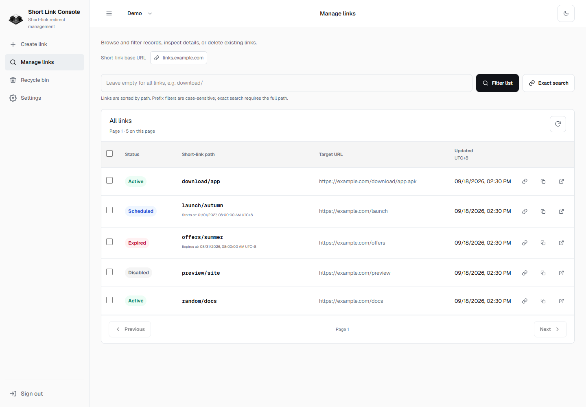

# Random Redirect Link Console

[简体中文](README.zh-CN.md) | English

A Next.js management console and version-controlled AWS Lambda source for
creating, listing, editing, enabling, disabling, and deleting redirect links.
The console supports Simplified Chinese, Traditional Chinese, and English.

## Console Preview

Captured from a local demo workspace using `example.com` addresses, without production data.
The screenshots show the English interface; Simplified and Traditional Chinese are also supported.



[View the full console gallery](docs/console-preview.en.md): link creation, details drawer, recycle bin, settings, environment configuration, member permissions, audit events, dark mode, and mobile layout.

## Architecture

```text
Browser
  -> Next.js console routes
  -> Management HTTP API (Cognito JWT)
  -> Control Lambda (membership and environment authorization)
  -> Admin HTTP API (IAM / SigV4)
  -> random-redirect-link-admin Lambda
  -> DynamoDB

Visitor opens a short link
  -> Public HTTP API
  -> random-redirect-link-api Lambda
  -> DynamoDB
  -> HTTP 301 or 302 redirect
```

Next.js forwards the user's access token to the management service. The control Lambda
checks membership and environment permissions, then signs Admin API requests with IAM.

## Features

- Create random-subdomain or fixed-target redirect links.
- Browse links with cursor pagination and path-prefix filtering.
- View, edit, enable, disable, and delete individual links.
- Batch enable, disable, move to the recycle bin, or restore up to 50 links.
- Schedule activation and expiry; recover soft-deleted links during a seven-day retention period.
- Inspect links in a details drawer, copy short URLs, and generate QR codes.
- Use light/dark themes and responsive mobile layouts, with browser-saved preferences.
- Switch between `zh-CN`, `zh-TW`, and `en` in the console.
- Select from multiple independently configured API environments.
- Manage members, environment grants, site configuration, and audit events.
- Build either small Lambda packages that use the runtime-provided AWS SDK v3
  or optional self-contained packages with pinned SDK dependencies.

## Project Layout

```text
app/                 Next.js App Router pages and server routes
lib/                 API target, validation, session, and i18n modules
lambda/control/      Management service, authorization, and workspace initialization
infrastructure/      Management and deployment-artifact stack templates
config/              Workspace configuration example
lambda/admin/        Admin Lambda source, tests, and packaging
lambda/api/          Public redirect Lambda source, tests, and packaging
template.yaml        Redirect backend SAM template
docs/                English and Simplified Chinese deployment guides
public/              Static assets, including the project favicon
```

## Requirements

- Node.js compatible with Next.js 16
- npm for the root Next.js project
- Node.js 24 and pnpm 11 for the Lambda subprojects
- PowerShell 7 for the included ZIP packaging scripts

## Console Configuration

The console uses Cognito authentication, a DynamoDB management plane, and IAM backend authentication.

Follow [Management-plane deployment](docs/control-plane.en.md). Initialize the workspace,
then set the server-only `MANAGEMENT_API_URL` to the stack output in Vercel (or `.env.local`).
The public `/public/site` endpoint supplies Region and Cognito Client ID; missing configuration prevents sign-in.
Git deployments need no local JSON file or prebuilt upload.
Site and environment configuration and member grants are edited in the console without a redeploy.
Default environment and page size are stored per user; language and theme remain browser preferences.

## Local Development

```powershell
npm install
npm run dev
```

After initializing the management stack and entry-point configuration, open `http://localhost:3000` and sign in with your invited Cognito account.

Useful checks:

```powershell
npm run lint
npx tsc --noEmit
npm run build
```

## Lambda Sources

| Function | Source | Handler | Required environment variables |
|---|---|---|---|
| `random-redirect-link-admin` | `lambda/admin` | `index.handler` | `TABLE_NAME`, `MANAGEMENT_ROLE_ARN`; optional `LINKS_INDEX_NAME` |
| `random-redirect-link-api` | `lambda/api` | `index.handler` | `TABLE_NAME` |

Build the recommended small packages:

```powershell
pnpm --dir lambda/admin install --frozen-lockfile
pnpm --dir lambda/admin package
pnpm --dir lambda/api install --frozen-lockfile
pnpm --dir lambda/api package
```

Both default packages externalize `@aws-sdk/*` and use the AWS SDK v3 included
in the Node.js 24 Lambda runtime. To pin and include the SDK instead, run
`package:self-contained` in the corresponding Lambda directory.

The management service in `lambda/control` is built with `pnpm --dir lambda/control build`
after installing its dependencies. Its bundle includes SDK dependencies and is deployed through
`infrastructure/control.yaml`; it does not use the Admin/public ZIP scripts.

## Deployment Guides

- Management service and workspace initialization: [English](docs/control-plane.en.md) | [简体中文](docs/control-plane.zh-CN.md)

- Complete AWS SAM infrastructure: [English](docs/infrastructure.en.md) |
  [简体中文](docs/infrastructure.zh-CN.md)
- Admin Lambda: [English](docs/lambda-admin-deployment.en.md) |
  [简体中文](docs/lambda-admin-deployment.zh-CN.md)
- Public API Lambda: [English](docs/lambda-api-deployment.en.md) |
  [简体中文](docs/lambda-api-deployment.zh-CN.md)

The guides cover packaging, least-privilege IAM, API Gateway routes, backups,
smoke tests, logs, and rollback. Building a package does not deploy it.

## Security and Operations

- Use an individual Cognito account and enable TOTP MFA. Scope environment grants to each user's needs.
- Management calls use the Lambda IAM role; no shared password or Admin token is needed.
  Never commit session tokens, downloaded Lambda packages, or backups.
- The public redirect API is intentionally unauthenticated. Apply API Gateway
  throttling and monitor Lambda errors, throttles, and duration.
- Scope the public Lambda role to `dynamodb:GetItem` on the link table. Scope the
  Admin Lambda role only to the table and its listing index operations.
- Keep deployment backups outside Git and verify the function state before and
  after each code update.

## Recycle bin and link schedules

Links accept optional ISO 8601 startsAt/expiresAt timestamps with an explicit timezone. Null clears a timestamp on PATCH; an omitted field is unchanged. The console displays Singapore time (UTC+8). GET and HEAD check deletion, enabled state and the current time on every request. Existing links without these fields remain compatible.

DELETE and batch delete soft-delete links for 7 days; repeating deletion does not extend retention. GET /links?view=trash lists deleted links (default view=links excludes them). PATCH /links/{path} with restore:true restores a link, optionally including revised schedule fields. Batch action restore supports up to 50 paths. Restoration preserves enabled state; an elapsed expiry must be extended or cleared. Recovery/renewal is refused at the retention deadline. Paths remain reserved until physical deletion.

DynamoDB TTL uses numeric Unix seconds in purgeAt, never expiresAt. Normal expiry schedules cleanup 7 days later; manual deletion schedules cleanup 7 days after deletion. TTL deletion is asynchronous. List filtering preserves pagination cursors; GSI results are eventually consistent. Conditional updates protect concurrent mutations; direct item reads are strongly consistent.

The SAM template enables DynamoDB TTL on `purgeAt`. Verify the same setting for manually managed tables. Restore uses the PATCH and batch routes.

## Contributing and Security

- See [CONTRIBUTING.md](CONTRIBUTING.md) for local setup, validation, and pull
  request expectations.
- Report vulnerabilities privately according to [SECURITY.md](SECURITY.md).

## License

Licensed under the [Apache License 2.0](LICENSE).
