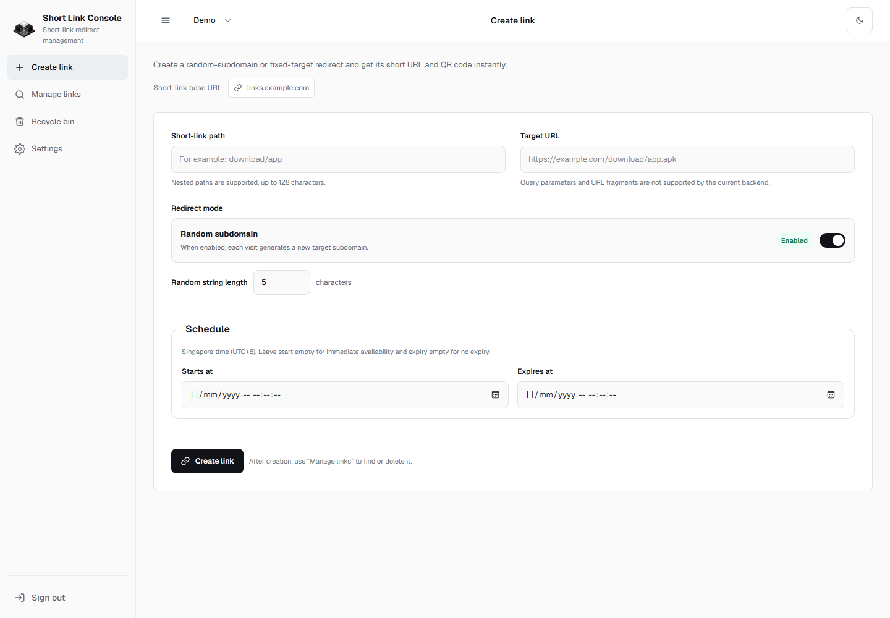
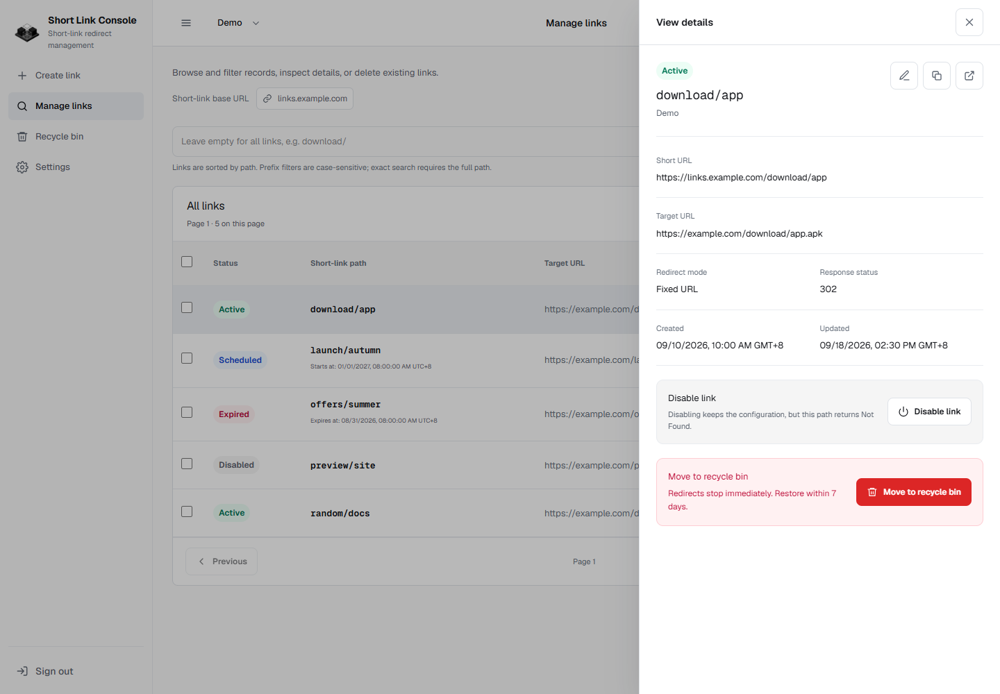
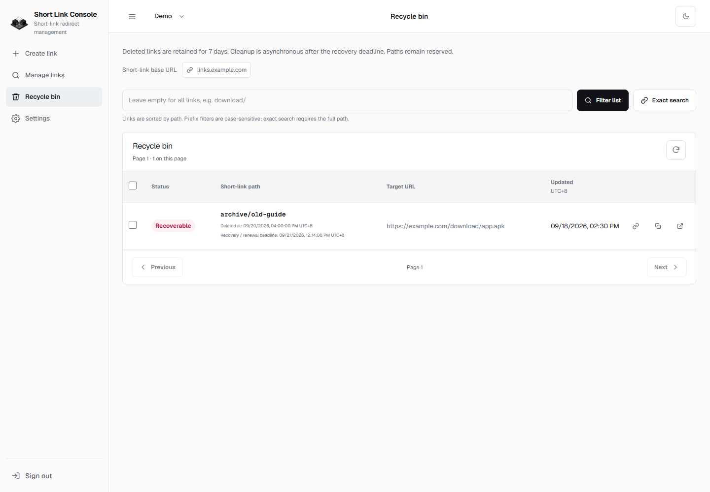
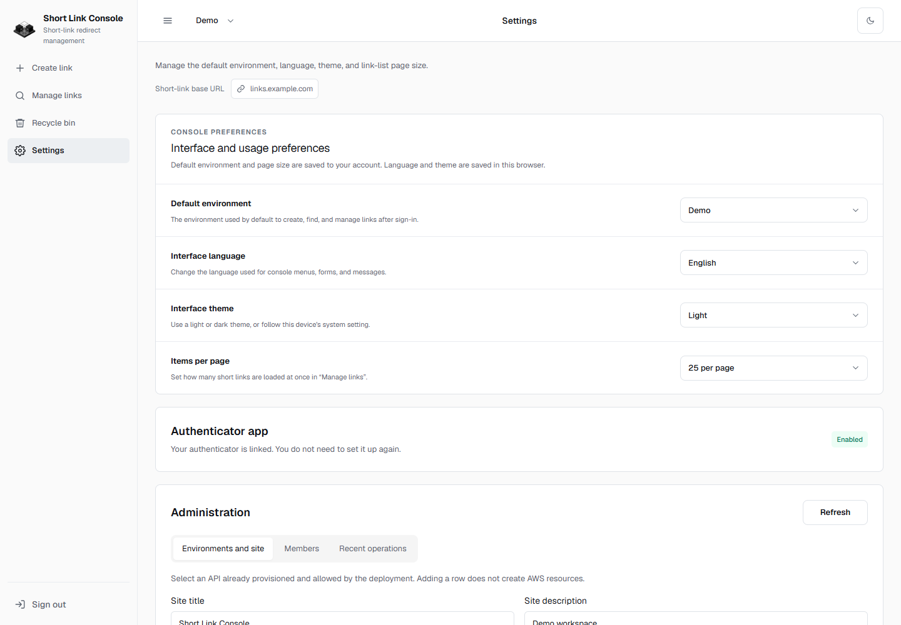
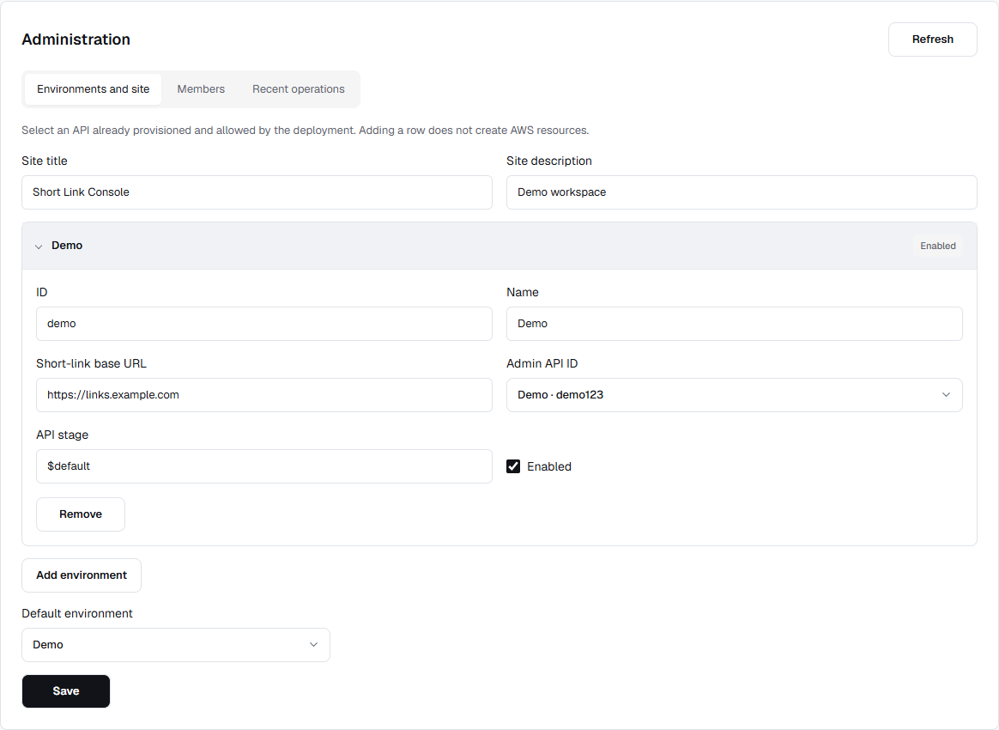
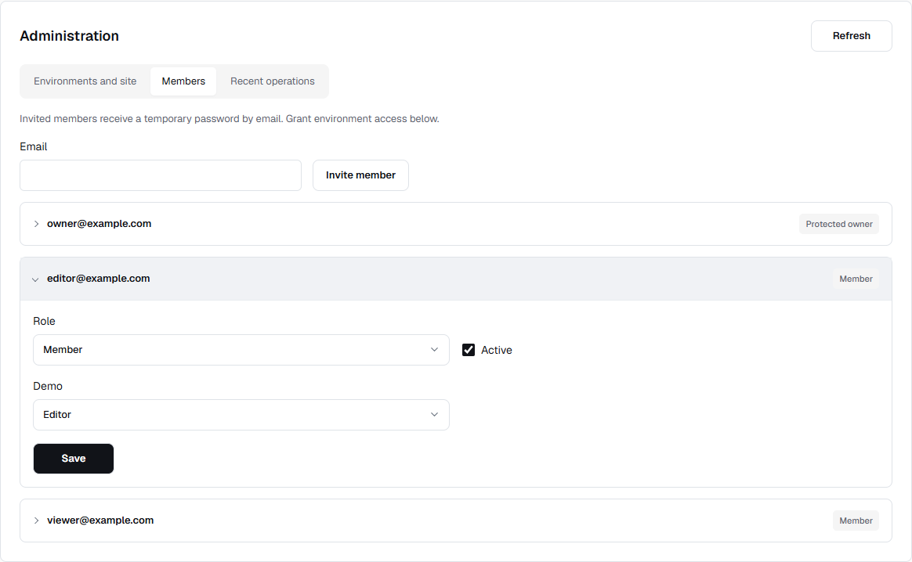
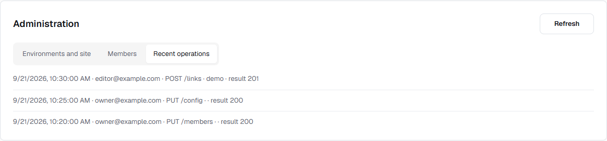
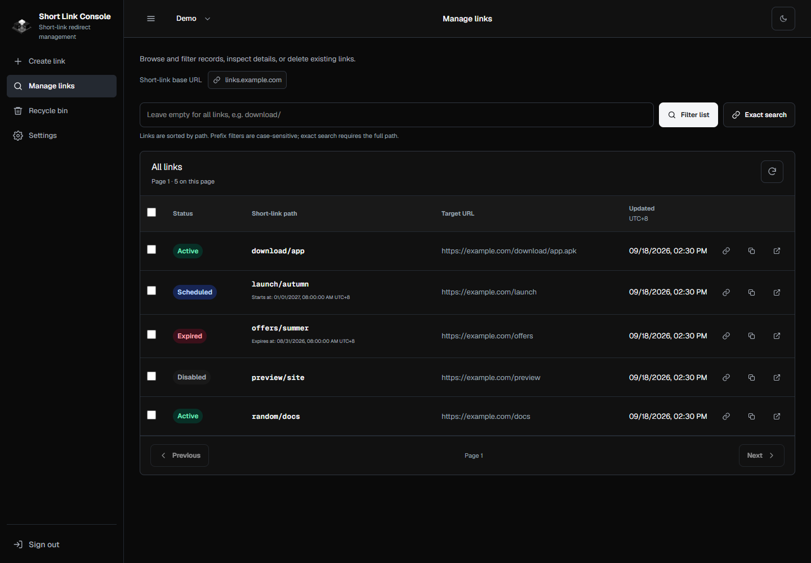
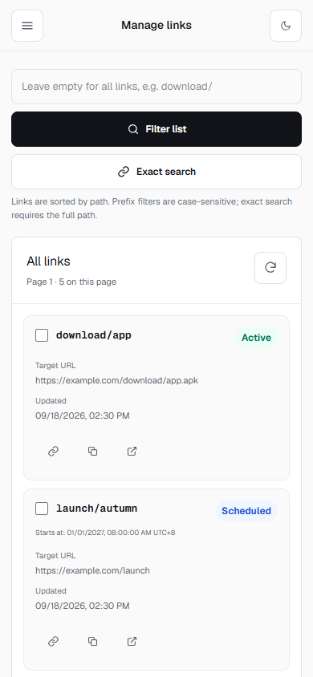

# Console Gallery

[Back to README](../README.md) | [简体中文](console-preview.zh-CN.md)

Captured on 2026-09-21 from the local application with demo data. Domains, dates, and statuses are illustrative, not production metrics. Desktop viewport: 1440 × 1000; mobile: 390 × 844. Screenshots use the English console interface. Management, member and audit images are cropped to their panels.

## Link management

Filter by path, browse pages, and distinguish active, scheduled, disabled, and expired links.

## Create links

Configure the path, destination, redirect mode, and schedule.

## Link details

Inspect the short URL, destination, and timestamps; edit, disable, or move the link to the recycle bin.

## Recycle bin

Review soft-deleted records and restore them within retention; expired links need an updated schedule.

## Console settings

Choose the default environment, language, theme, and page size. The default environment and page size are saved to your account; language and theme are saved in the current browser. Authenticator status is shown below these preferences.

## Management service

Configure the site title, description, default environment and allowed Admin API mapping.

## Member permissions

Invite members and assign viewer or editor access per environment. The owner account is protected.

## Recent operations

Review example audit events with the actor, operation, environment and result.

## Dark mode

Status badges remain distinct in the dark theme.

## Mobile layout

Narrow screens use link cards and collapsible navigation. The mobile header keeps the page title centered; the desktop environment switcher is hidden.

## Updating screenshots

Use a local demo workspace and `example.com` fixture data. Wait for fonts, data, and animations before capture. Hide developer overlays while preserving the actual controls and layout. Never include passwords, tokens, or production links. After replacing `docs/images/en/console-*.png`, keep English and Simplified Chinese screenshots in their matching language directories and check image links and captions in both READMEs and galleries.
