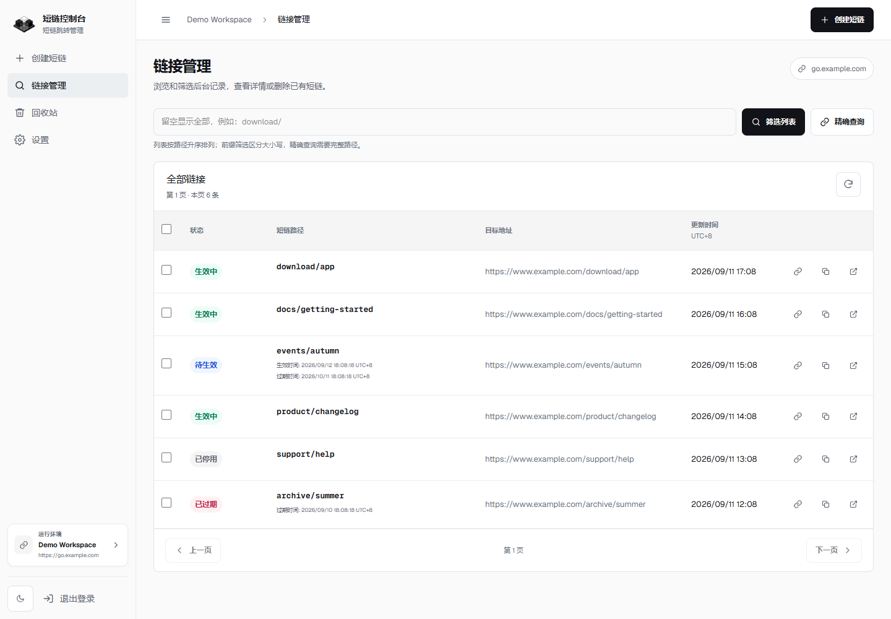
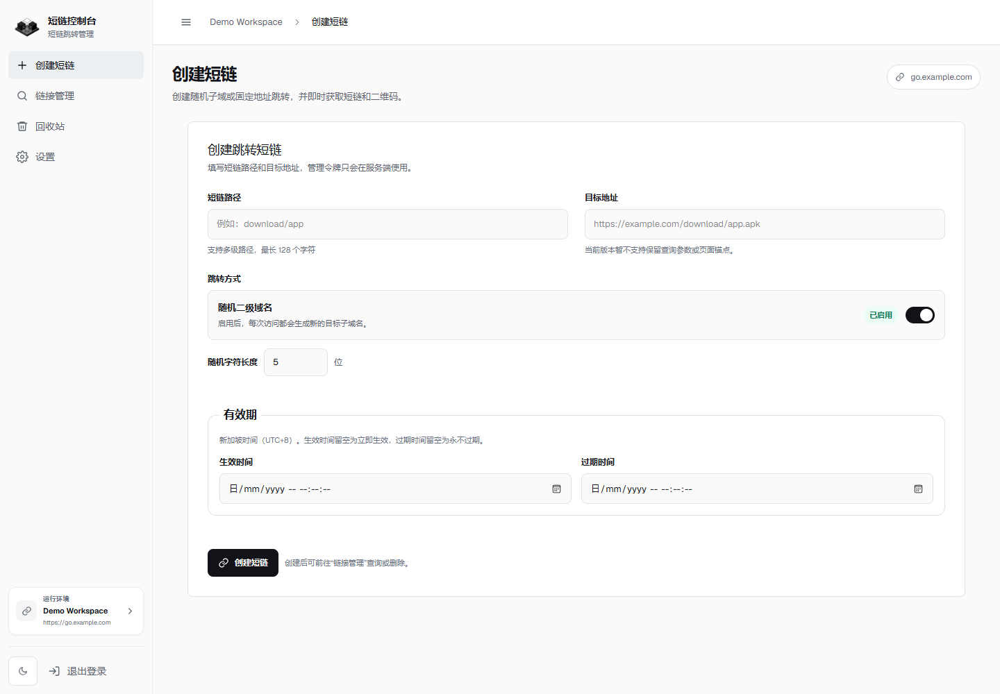
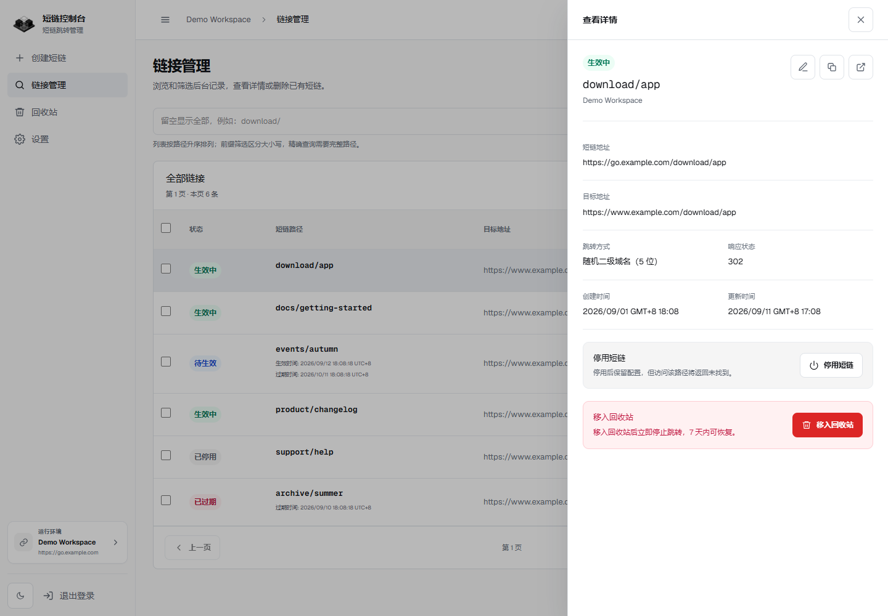
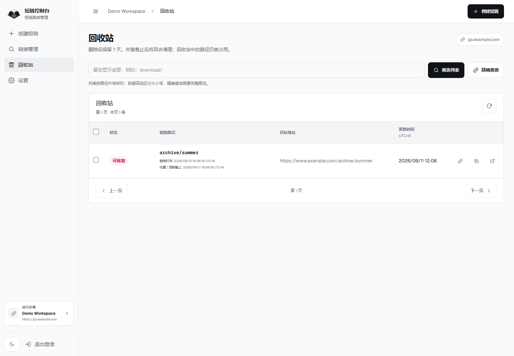
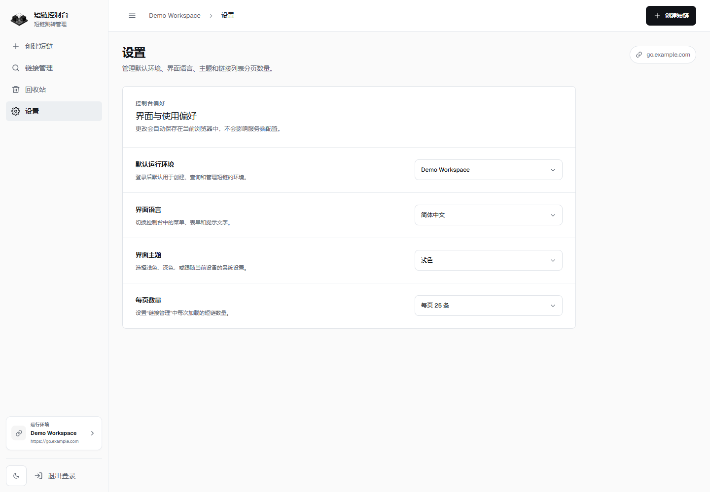
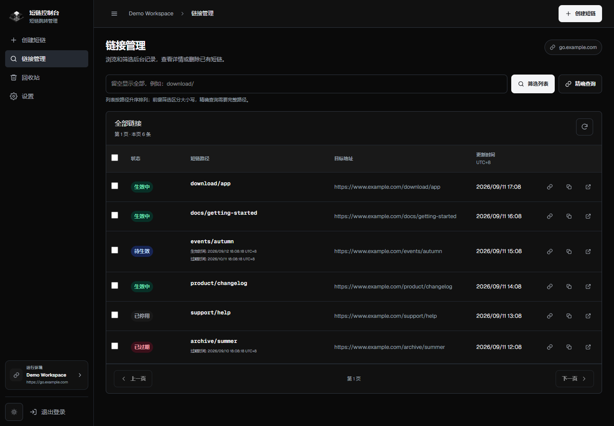
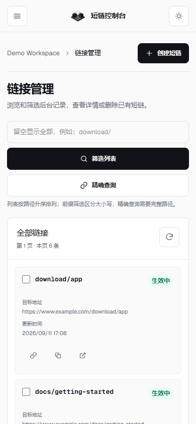

# 控制台面板图集

[返回 README](../README.zh-CN.md) | [English](console-preview.en.md)

截图于 2026-09-11 使用本地界面和演示数据拍摄。域名均为示例地址，状态与日期用于展示；不代表生产环境统计。桌面视口为 1440 × 1000，移动端为 390 × 844。

## 链接管理

按路径筛选和分页浏览，查看生效中、待生效、已停用及已过期状态。

## 创建短链

配置路径、目标地址、跳转方式与有效期。

## 链接详情

在抽屉中查看短链、目标地址与时间信息，并进行编辑、停用或移入回收站。

## 回收站

查看软删除记录，在保留期内恢复；已过期记录需调整有效期后恢复。

## 控制台设置

调整默认环境、语言、主题和每页数量，偏好保存在当前浏览器。

## 深色模式

链接状态保留颜色提示，适合深色界面使用习惯。

## 移动端

窄屏下使用卡片列表和折叠导航。

## 更新截图

使用本地演示环境与 `example.com` 示例数据，等待字体、数据加载和动画完成后截图。隐藏开发工具浮层，保留真实控件和布局；不得包含密码、令牌或生产链接。替换 `docs/images/zh-CN/console-*.png` 后，英文截图保存到 `docs/images/en/`，简体截图保存到 `docs/images/zh-CN/`，同步检查对应语言 README 和图集的图片链接与说明。
