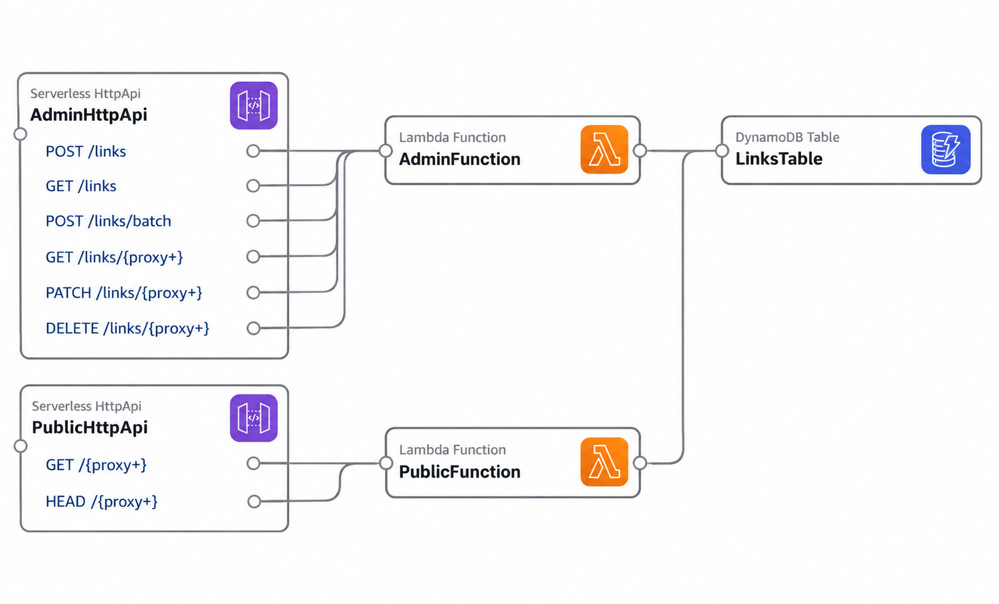
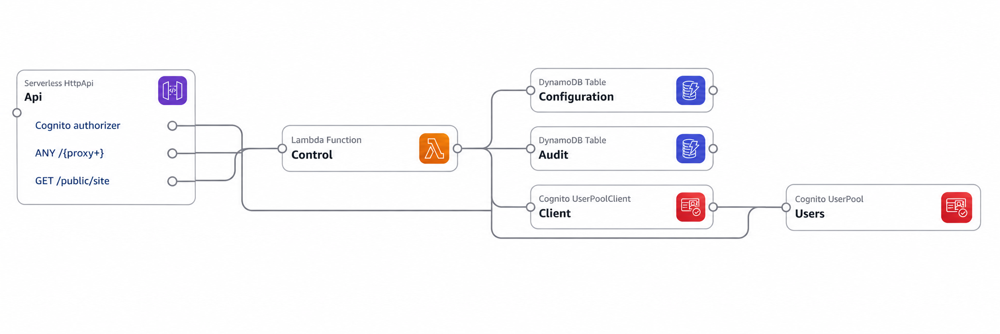

# AWS SAM infrastructure

[简体中文](infrastructure.zh-CN.md) | English

## Stack layout

- `template.yaml`: redirect backend, with a retained DynamoDB link table, `links-by-path` GSI, `purgeAt` TTL, Admin and public HTTP APIs, and two Node.js 24 Lambda functions.
- `infrastructure/control.yaml`: Cognito user pool/client, retained configuration and audit tables, management HTTP API, and control Lambda.
- `infrastructure/artifacts.yaml`: optional private, encrypted, versioned S3 bucket for deployment artifacts.

Admin routes require `AWS_IAM`. The control Lambda checks user membership and environment grants, then signs requests with its IAM role. Public redirect routes are unauthenticated. The console connects to the management service using the server-only `MANAGEMENT_API_URL`.

Templates create resources; they do not automatically adopt manually managed resources. Retained tables, user pools and artifact buckets need explicit cleanup after stack deletion.

## Architecture canvases

These canvases were exported from the project's SAM templates using AWS Infrastructure Composer and cleaned up for documentation. They show the main resource relationships and omit supporting resources such as logs and IAM. Connections represent template relationships, not the complete request flow or live deployment state.

### Redirect backend



Source: [`template.yaml`](../template.yaml). The Admin API uses IAM authentication; the public API provides unauthenticated GET/HEAD redirects.

### Management and authentication service



Source: [`infrastructure/control.yaml`](../infrastructure/control.yaml). Management routes use Cognito JWT authentication; `GET /public/site` is unauthenticated. The `Cognito authorizer` label corrects a display placeholder in the Composer export without changing the template configuration.

The Control Lambda calls the backend Admin API through configuration; this cross-template call is not shown in either canvas. The deployment artifact bucket template, `infrastructure/artifacts.yaml`, is also omitted.

## Validate and build

Install dependencies for all three Lambda packages before building. Use separate SAM build directories and configuration files to avoid deploying the wrong stack.

```powershell
cfn-lint template.yaml infrastructure/control.yaml infrastructure/artifacts.yaml
sam validate --lint --template-file template.yaml
sam validate --lint --template-file infrastructure/control.yaml
sam build --template-file template.yaml --build-dir .aws-sam/backend
sam build --template-file infrastructure/control.yaml --build-dir .aws-sam/control
```

Run your organization's CloudFormation Guard rules before production deployment.

## Parameters and deployment

For an existing backend, deploy the management stack with the verified Admin API IDs in `BackendApiIds` and matching, scoped execute-api ARNs in `BackendInvokeArns`. Its `ManagementRoleArn` output must match the Admin Lambda's `MANAGEMENT_ROLE_ARN`.

For a new installation, the two templates have a provisioning dependency: the backend requires a management-role ARN, while the management stack requires backend API IDs. Plan resource provisioning and parameter updates before deploying either stack; the templates do not provide a one-command combined bootstrap. Keep the Admin API IAM-protected throughout provisioning.

Review `Environment`, `ManagementRoleArn`, `LinksIndexName`, log retention, rate and burst limits for each backend stack. For the management stack, also review `WorkspaceId` and the backend allowlist.

Deploy the intended built template explicitly:

```powershell
sam deploy --guided --template-file .aws-sam/backend/template.yaml --config-file samconfig.backend.toml
sam deploy --guided --template-file .aws-sam/control/template.yaml --config-file samconfig.control.toml
```

These are separate stack operations; execute only the operation needed for the current deployment.

Use backend outputs to configure the workspace's target `apiId`, `stage`, and `redirectBaseUrl`. The SAM backend URLs include the `Environment` stage. Follow [Management service deployment](control-plane.en.md) to initialize the owner and workspace, then set `MANAGEMENT_API_URL` from `ManagementApiUrl`.

## Verification and operations

- Verify all Admin routes use IAM and payload format 2.0, with access limited to the designated control role.
- Verify Cognito sign-in, member grants, create/list/update/batch/delete/restore, and public GET/HEAD redirects.
- Confirm `purgeAt` TTL, PITR, logs, retention, throttling and monitoring.
- Back up function packages and configuration before updates; use compatible IAM-authenticated versions for rollback.
- Keep deployment records and credentials outside Git.
